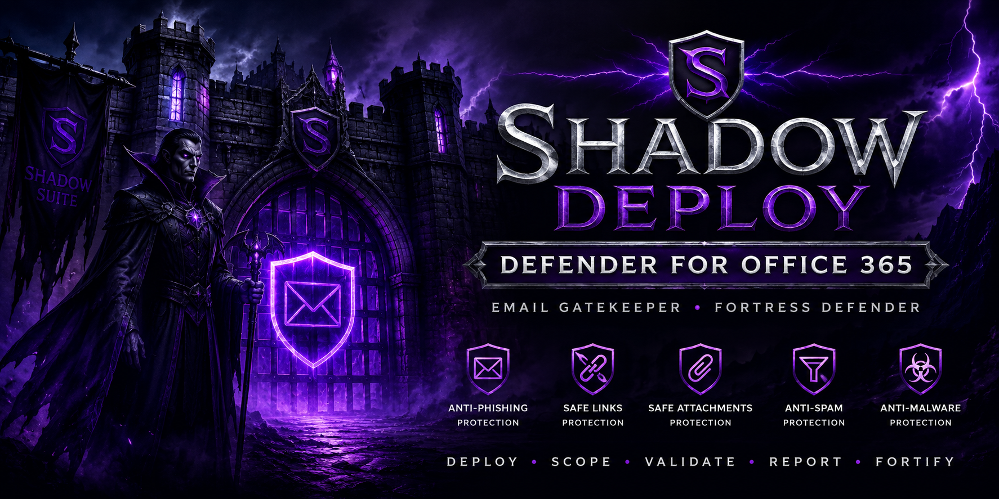

<p align="center">
  
</p>

<p align="center">
Email Gatekeeper • Fortress Defender • Zero Trust Email Security
</p>

## Quick Start

1. Install ExchangeOnlineManagement
2. Launch ShadowDeploy-DFO365.ps1
3. Connect Exchange Online
4. Deploy All Custom Policies
5. Generate Report

📘 Walkthrough Guide
🧪 Validation Scenarios
✅ Smoke Test Checklist


Shadow Deploy – Defender for Office 365 is a PowerShell-based deployment, validation, and reporting framework designed to simplify Microsoft Defender for Office 365 policy deployment using a guided operational interface.

The tool provides a repeatable method for deploying, validating, documenting, and reporting on Defender for Office 365 security controls while maintaining a professional operator experience and executive-ready reporting.

---

## Features

### Core Deployment

* Anti-Phishing deployment
* Safe Attachments deployment
* Safe Links deployment
* Inbound Anti-Spam deployment
* Anti-Malware deployment
* Deploy All Custom Policies workflow

### Operational Features

* Exchange Online connectivity validation
* Configuration validation
* JSON-driven policy deployment
* Policy status tracking
* Execution logging
* Deployment evidence collection
* HTML reporting
* JSON export support
* Backup support
* Open Logs functionality

### Reporting Features

* Executive Summary
* Deployment Status Dashboard
* Protection Level Comparison
* Security Heat Map
* Policy Inventory
* Deployment Timeline
* Recommendations
* Operational Evidence

### Assign Scope Capability

Shadow Deploy supports optional policy scoping using a mail-enabled Microsoft 365 group.

When enabled:

1. Check **Enable Policy Scoping**
2. Enter a valid mail-enabled Microsoft 365 group name
3. Deploy policies
4. Optionally run Assign Policy

The tool applies supported Defender for Office 365 policy rules to the specified target group.

---

## Requirements

### Supported Platforms

* Windows PowerShell 5.1+
* PowerShell 7+

### Required Module

```powershell
Install-Module ExchangeOnlineManagement -Scope CurrentUser -Force -AllowClobber
```

### Required Permissions

One of the following:

* Global Administrator
* Security Administrator
* Exchange Administrator

---

## Installation

```powershell
git clone https://github.com/<YOUR-REPOSITORY>.git
```

Navigate to:

```powershell
cd .\scripts
```

Install required module:

```powershell
Install-Module ExchangeOnlineManagement -Scope CurrentUser -Force -AllowClobber
```

Run:

```powershell
.\ShadowDeploy-DFO365.ps1
```

---

## Project Structure

```text
ShadowDeploy-DFO365
│
├── Assets
│   └── shadowdeployo365.png
│
├── Config
│   ├── DFO365_ZeroTrust.json
│   └── SettingsCatalog
│
├── Exports
│
├── Logs
│
├── Reports
│
└── Scripts
    └── ShadowDeploy-DFO365.ps1
```

---

## Shadow Suite Identity

Shadow Deploy – Defender for Office 365 serves as the Email Gatekeeper within the Shadow Suite ecosystem.

Theme:

* Fortress Defender
* Email Security Guardian
* Zero Trust Deployment Framework
* Microsoft Defender Operational Toolkit

---

## Current Release Baseline

Current Stable Baseline:

**Shadow Deploy – Defender for Office 365 V1.4**

This release includes:

* Updated Shadow Suite branding
* Assign Scope functionality
* Open Logs integration
* Executive reporting
* Protection comparison reporting
* Heat Map visualization
* Deployment evidence export
* Improved deployment workflow

---

## Disclaimer

Always validate changes in a non-production environment before deploying to production tenants.

This tool is provided as-is without warranty.

---

## License

Shadow Suite Community Edition
Business Source License 1.1

Copyright (c) 2026 Derrick Ferrell
All rights reserved.

Licensor:
Derrick Ferrell

Licensed Work:
Shadow Suite Community Edition, including but not limited to:
- Shadow Trace Ops
- Shadow Deploy
- Shadow Verify
- Shadow Suite investigation framework
- Shadow Suite reporting framework
- Shadow Suite UI/branding components
- Associated PowerShell tooling, dashboards, exports, playbooks, and report templates

--------------------------------------------------------------------------------
Business Source License 1.1
--------------------------------------------------------------------------------

Parameters

Licensor:
Derrick Ferrell

Licensed Work:
Shadow Suite Community Edition

Additional Use Grant:
You may use this software for:
- personal use
- educational use
- internal organizational evaluation
- research
- defensive security testing
- lab environments
- non-commercial security operations

You may:
- view and modify the source code
- contribute improvements
- fork the project for non-commercial purposes
- use the software internally within your organization

You may NOT:
- commercially sell the software
- offer the software as a managed service
- host the software as a SaaS offering
- redistribute the software commercially
- rebrand the software or associated reports/UI
- use Shadow Suite branding or logos without written permission
- sublicense the software commercially
- embed the software into commercial products or consulting offerings without authorization

Commercial usage, resale, managed service integration, redistribution, SaaS hosting, OEM integration, or derivative commercial offerings require explicit written authorization from the Licensor.

Change Date:
January 1, 2030

Change License:
GNU Affero General Public License v3.0 (AGPLv3)

--------------------------------------------------------------------------------
Terms
--------------------------------------------------------------------------------

The Licensor hereby grants you the right to copy, modify, create derivative works, redistribute, and make non-commercial use of the Licensed Work, subject to the limitations and conditions below.

If your use of the Licensed Work includes any commercial activity, monetization, paid consulting integration, hosted services, resale, managed service delivery, or revenue-generating derivative work, you must obtain separate written commercial licensing from the Licensor.

All copies of the Licensed Work and derivative works must retain:
- this license
- copyright notices
- attribution to the Licensor
- all NOTICE file references

--------------------------------------------------------------------------------
Restrictions
--------------------------------------------------------------------------------

The following are expressly prohibited without prior written permission:

- Commercial resale of the software
- Repackaging or redistribution for paid offerings
- Rebranding or removal of Shadow Suite branding
- Use of logos, report styles, or UI identity in competing products
- SaaS deployment for customer-facing commercial services
- Managed security service provider (MSSP/MSP) redistribution
- OEM or embedded redistribution
- Commercial forks or derivative commercial offerings

--------------------------------------------------------------------------------
Branding and Trademark Notice
--------------------------------------------------------------------------------

"Shadow Suite", "Shadow Trace Ops", "Shadow Deploy", associated logos, branding, UI themes, report styling, and visual identities are property of Derrick Ferrell and are not licensed for reuse, redistribution, or commercial branding purposes without explicit written authorization.

This license grants rights only to the source code and associated non-commercial usage rights described above.

--------------------------------------------------------------------------------
Contributions
--------------------------------------------------------------------------------

By submitting code, pull requests, modifications, or contributions to this repository, you agree that your contributions may be incorporated into future commercial or non-commercial Shadow Suite releases.

Contributors retain copyright to their own contributions but grant the Licensor a perpetual, worldwide, non-exclusive right to use, modify, sublicense, and distribute those contributions as part of the Licensed Work.

--------------------------------------------------------------------------------
Disclaimer
--------------------------------------------------------------------------------

THIS SOFTWARE IS PROVIDED "AS IS", WITHOUT WARRANTY OF ANY KIND, EXPRESS OR IMPLIED, INCLUDING BUT NOT LIMITED TO WARRANTIES OF MERCHANTABILITY, FITNESS FOR A PARTICULAR PURPOSE, NON-INFRINGEMENT, OR SECURITY EFFECTIVENESS.

IN NO EVENT SHALL THE LICENSOR BE LIABLE FOR ANY CLAIM, DAMAGES, LIABILITY, OR OTHER LOSS ARISING FROM THE USE OF THIS SOFTWARE.

Users are solely responsible for validating results, detections, configurations, and investigative findings generated by the software.

--------------------------------------------------------------------------------
Security Tooling Notice
--------------------------------------------------------------------------------

Shadow Suite Community Edition is intended for:
- defensive security operations
- investigation workflows
- threat hunting
- visibility and posture assessment
- security research
- operational analytics

The software is not guaranteed to detect all threats, misconfigurations, or malicious activity.

Use of this software must comply with all applicable laws, regulations, and organizational policies.

--------------------------------------------------------------------------------
Copyright
--------------------------------------------------------------------------------

Copyright (c) 2026 Derrick Ferrell
All rights reserved.
